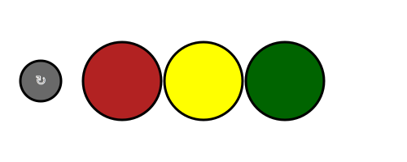

# diversusprotoassets

Continously deployed design assets for the Diversus site

## URL Mappings

This table illustrates the mapping between paths in this repo and the deployment urls.

| path | url |
|------|-----|
| `public` |  https://diversus.nooron.com/diversus/ |
| `public/experiments/` |  https://diversus.nooron.com/diversus/experiments/ |
| `public/graphics/` |  https://diversus.nooron.com/diversus/graphics/ |
| `public/experiments/foreignObjectHtmlForm.svg` | https://diversus.nooron.com/diversus/experiments/foreignObjectHtmlForm.svg |

## TIPS

* Feel free to reorganize things, but only contents of the `public` directory will arrive at https://diversus.nooron.com/diversus
* Please don't add big libraries directly to this repo, it would probably be better to use npm or yarn for that.  Shawn can help!

## Resources for SVG and Javascript integration

* https://inkscape.org/learn/animation/
* https://tympanus.net/Tutorials/ResponsiveSVGs/
* http://old.carto.net/papers/svg/samples/
* http://old.carto.net/papers/svg/manipulating_svg_with_dom_ecmascript/index.shtml
* http://snapsvg.io/

## Experiments go in the `experiments` directory

### a tiny example of embedding an HTML form inside an SVG document

This looks OK here in GitHub but it does not work properly on GitHub for security reasons. It should work properly when viewed on the Nooron server.

* `public/experiments/foreignObjectHtmlForm.svg`
* https://diversus.nooron.com/diversus/experiments/foreignObjectHtmlForm.svg

### the trafficlights example of javascript within .svg

Again, this looks fine here on GitHub but does not actually *work* unless you view it when served by a normal server such as the Nooron site.

* https://github.com/doctorEeevil/svgplay see the .js version
* `public/experiments/trafficlights.svg`
* https://diversus.nooron.com/diversus/experiments/trafficlights.svg

## Suggestion, mockups go in the `_graphics_dev` directory

### a page from the Diversus prototype mockups from Figma

* `public/_graphics_dev/Mobile_Login_02_deeplinke_sent.svg`
* https://diversus.nooron.com/diversus/_graphics_dev/Mobile_Login_02_deeplinke_sent.svg

